# 研究進度報告 · 2026-09-22

> 上次會議：2026-09-15。老師當次給的具體驗收標準：「你的介面如果示範說，你如果把
> 2025 喬到賺錢，而且還是用那套（台股）策略，這樣就差不多了」，並以自己的操盤經驗
> 指出「2025 年 4 月開始，5、6 月我們就已經發現所有都是大型股在漲」，也提到
> 「a sequence of monitoring screens」「分時間尺度的解釋題」等具體要求。
>
> 這份報告要講清楚四件事：**這套監控系統長什麼樣子、實際怎麼跑、跑出來的結果
> 如何、為什麼結果跟大盤還有落差、這個落差能不能解決**。最後列出幾個需要
> 老師拍板的方向。

---

## 一、這套監控系統在做什麼

### 1.1 一句話講清楚

這套系統**不是重新選股**。選股的方法（那套因子邏輯）完全沒變，維持老師「還是
用那套策略」的要求。這套系統做的是：**每一季檢查一次「現在的市場狀況，跟我們
剛開始投資時比起來，有沒有變得很不一樣」，如果變得很不一樣，就决定要不要調整、
怎麼調整**。

整套系統分三塊，運作順序是：

```
先看「現在市場正不正常」（前瞻層）──唯一真正會觸發調整動作的地方
      ↓
再看「上一季的結果是怎麼來的」（回顧層）──純粹事後解釋，不會觸發任何動作
      ↓
最後從五個選項裡挑一個該做的事（動作空間）
```

### 1.2 前瞻層：像一個「大盤集中度的煙霧偵測器」

**它在偵測什麼**：每一季，系統會去看「整個大盤（不是我們自己的投組，是整個
市場）」有沒有變得比以前更集中在少數幾檔超大型股票上——具體做法是算「市值
最大的前 20% 股票，佔了整個市場多少比重」，拿這個數字跟「我們剛開始投資時」
的水準比較，看變化了多少。

**關鍵：它只看大盤本身，完全不看我們自己的投組表現好不好**——這是刻意設計的，
不希望這個警報系統被「我們自己最近賺錢還是賠錢」干擾，只單純問一個乾淨的
問題：「現在的市場環境，跟我們當初開始投資時比起來，有沒有變得很不一樣？」

**為什麼要偵測這個**：我們的投組是**平均分散**持有很多檔股票，不是集中壓在
少數大股票上。如果大盤本身變得越來越集中在少數幾檔超大型股票（例如台積電這種），
那不管選股選得多好，「平均分散」這個做法本身就會自動錯過那些超大型股票貢獻的
大部分漲幅——**不是我們做錯了什麼，是市場的結構本身變了**。這個偵測器，就是
負責即時察覺「市場結構是不是已經變得跟我們當初設計投組時很不一樣了」。

三個燈號：

| 燈號 | 白話意思 | 系統的判斷條件 | 會做什麼 |
|---|---|---|---|
| 🟢 正常 | 大盤結構跟一開始差不多，沒事 | 偏離幅度在小範圍內（≤1.2個百分點）| 什麼都不做 |
| 🟡 觀察中 | 開始有點偏離常態，先列入觀察，還不用緊張 | 偏離幅度中等（1.2~1.86個百分點），且上一季不是紅燈 | 列入觀察名單 |
| 🔴 警戒 | 偏離幅度已經超過歷史上少見的程度，要警覺了 | 偏離超過1.86個百分點，**或**上一季已經是紅燈（避免才剛降溫一點點就急著解除警報）| 升級給人做最後決定 |

這個「1.2／1.86 個百分點」的**數值**，是用 2007~2023 年（**完全沒碰過這次
實驗要測的 2024-2025 年**）的歷史資料算出來、事先訂死的，不是看了這次的
結果之後才回頭訂的標準。

⚠️ **誠實講一個限制，數值訂死不代表整套指標完全沒看過答案**：這個「只看
大盤指數端集中度」的**判斷方式本身**，是團隊看過舊版指標（同時看投組端）在
2024-2025 幾乎不觸發之後，才改成現在這個版本的——舊版被換股雜訊稀釋、
新版才有鑑別力，是先看到「舊指標抓不到已知該抓到的異常」才回頭改設計。
所以嚴謹地說：**數值門檻是事前訂的，但「用什麼方式量測」這個設計選擇，
是看過目標期間的結果之後才定案的**，這是比單純調參更隱蔽的一種資料窺探，
要誠實揭露。另外，門檻背後真正互相獨立的歷史樣本只有 n=8（滾動視窗會
互相重疊，不是真的8個獨立觀察），樣本數不大。

**為什麼特別強調這是唯一會觸發動作的地方**：後面會介紹的另外七種診斷，全部都是
**事後諸葛**——季度結束後才解釋「這一季表現不好是為什麼」，純粹是事後說明，
**不會觸發任何調整動作**。只有這個前瞻層的燈號，是當下就在看「現在值不值得
採取行動」，是整套系統裡唯一真正會影響「接下來要不要調整」的機關。用煙霧
偵測器比喻：前瞻層是偵測器本身，響了就要決定要不要滅火；後面那七種診斷，
比較像事後的火災調查報告，能告訴你「上次那場火怎麼燒起來的」，但沒辦法在
當下幫你滅火。

### 1.3 回顧層：七種「事後解釋為什麼」的診斷

每一季結束後，系統會自動檢查七種可能讓結果變差的原因，**純粹用來解釋，
不會觸發任何投組調整**。分成兩組：

**第一組（可以算出具體貢獻多少 pp）**——像拆解一筆總支出，看每個項目各花了
多少錢：

| 白話問題 | 正式代號 | 目前狀態 |
|---|---|---|
| 「因為我們平均分散、沒有跟著大盤集中在少數股票，這件事實際讓我們少賺了多少？」| M1-R | ✅ 這次完成（原本只是一次性手算，這次做成系統正式功能）|
| 「我們的選股方法，選出來的組合比『把候選名單全部買下來』還差嗎？」| M4 | ✅ 完成 |
| 「就算把整個候選名單全部買下來，還是輸給『隨便買大盤』嗎？——如果連這個都輸，代表整套選股邏輯本身可能已經不適合這個環境，不是選得不好，是方法本身的問題」| M7 | ✅ **這次第一次真的能運作**（之前這個機制寫在設計裡但因為程式上的一個技術限制，從來沒有真正跑過）⚠️見下方限制說明 |

⚠️ **M7 的限制要誠實講**：判斷「候選池整體失效」用的門檻（歷史p10≈+0.03
個百分點／季），是從候選池「相對等權大盤」的歷史表現算出來的——但這個
候選池本身，就是從全部策略裡**篩出全期間贏過基準的那些**才留下來的（這是
候選池篩選機制的既有前視偏誤，完整揭露見`研究框架總覽_v10.md`§8，本報告
只摘要跟M7門檻直接相關的部分）。這代表候選池歷史上平均本來就贏等權大盤
+1.58個百分點／季、89%的季度是正的——**門檻本身被這個篩選機制墊高了**。
所以「M7觸發」比較準確的講法是「相對一個被墊高的歷史基準，這段期間表現
不如預期」，不宜直接讀成「候選池方法論整體失效」這麼強的結論。同一個
篩選機制，也讓本報告§3所有的**絕對報酬數字**（+7.22%／+24.70%／大盤
+70.55%等）系統性偏高——這些數字之間**互相比較**（誰比誰好、差距縮小
了多少）仍然有意義，但任何一個單獨拿出來，都**不能當成這套系統未來的
預期報酬**。

**第二組（只能講「有沒有異常」，沒辦法算出具體貢獻多少）**：

| 白話問題 | 正式代號 | 目前狀態 |
|---|---|---|
| 「這次選到的股票數量，是不是比平常異常地多或異常地少？」| M3 | ✅ 完成 |
| 「投組會不會不小心全部押在同一個產業？」| M8 | ✅ 完成 |

**兩個「保底」判斷**（前面六個都對不上時才會用到）：

| 白話問題 | 正式代號 |
|---|---|
| 「以上都沒問題，這次表現不好只是正常的運氣起伏」| M6 |
| 「表現真的異常不好，但上面所有原因都對不上——誠實承認『不知道為什麼』，不硬掰一個理由」| M0 |

**M0 這一條特別重要**：如果真正的原因根本不在這張清單上，系統寧可誠實講
「查不出原因」，也不會硬套一個看起來最像的理由去搪塞——因為錯誤的解釋，
會讓後面的決定跟著判斷錯誤。

**另外兩種目前技術上還做不到的診斷**（誠實記錄，不是忘記做）：

- 「投組是不是不小心太集中在某一群高度相似的策略上？」——需要另外一套資料
  串接，這次還沒接上。
- 「這次選股的風格，跟一開始比起來有沒有明顯漂移？」——現在系統的算法設計下，
  這個指標在整季之內數學上恆定不變，測不出任何漂移，不是資料不夠，是這個
  指標的算法本身在這套系統裡量不到東西。

### 1.4 五個可以選的動作

| 動作 | 白話意思 | 目前狀態 |
|---|---|---|
| 維持現狀 | 什麼都不做 | ✅ |
| 觀察名單 | 先記下來持續追蹤，但不動手 | ✅ |
| 換一種分配方式 | 換個方式決定「錢要怎麼分給各群策略」，但**這個換法解決不了規模曝險問題**（已驗證過）| ✅ |
| 升級人工覆核 | 這件事交給人做最後決定 | ✅ |
| **條件式市值傾斜（W2c）** | 只有紅燈亮的時候，暫時把持股改成「跟大盤結構更像」的配置方式，紅燈解除就恢復原樣 | 🟡 **完成前置驗證，且真的接上了執行（選了它會真的改變下一季的實際持股，不是紙上談兵）——但驗證力道要誠實講清楚，見§3.1**：是單一事件、事後設計出來的機制，找不到歷史上獨立的類似事件可以驗證，「前瞻驗證」用的2026上半年也是同一段大型股行情的延伸，不是真正不同的市場環境 |

### 1.5 有沒有人在迴圈裡

系統有兩種運作模式：一種是**全自動**，agent 自己決定要選哪個動作，人完全
不介入（這次真實跑的 8 季用的就是這個模式）；另一種是**agent 決定完之後，
人可以再跟它對話最多 5 輪，討論要不要照做**——這個對話介面已經做好了，
**但還沒有真的拿它跑過一次真實對話**。

⚠️ **誠實講「AI自主決策」目前實際展現出來的價值**：這次真實跑的8季，
agent每一季的決定，跟程式依規則算出的建議動作（`triggers.py`的固定
映射：正常→維持現狀，警戒→升級人工覆核）**逐季核對下來完全一致，
8季裡沒有一次偏離規則的建議**。也就是說，這次還沒有觀察到AI做出「不同於
規則建議」的自主判斷，AI目前展現的價值是**可稽核的文字解釋跟理由**，
不是「决策路徑因為AI介入而改變了」。另外，這次用的模型（GPT-5）知識
截止時間點跟被評估的2024年資料有重疊的可能性，無法完全排除模型在推理
2024年當下狀況時，其訓練資料裡已經包含2024年後來實際發生的市場結果——
這不是現有的資料洩題防線（只防prompt裡夾帶未來數字）能處理的風險，是
另一類更難排除的污染，這裡誠實揭露、暫時無法量化排除多少影響。

---

## 二、實際怎麼跑：一季的完整流程

### 2.1 一季總共跑七個步驟

```
①一開始先登記    設定好「什麼情況算異常」的判斷標準
②每季量測一次    重新算一次現在的持股、三層指標、已經實現的績效
③a事後解釋      七種診斷機制檢查一輪（只能解釋，物理上根本看不到能拿來做決定的資料）
③b前瞻檢查      前瞻層燈號檢查（唯一能觸發動作的步驟，物理上看不到事後解釋的資料）
④做決定        agent 從五個動作裡選一個，必須說明依據哪個前瞻證據
⑤人機對話      （只有開放對話模式才有，最多5輪，也可以一起提出清單外的新點子，但要註明沒驗證過）
⑥寫總結        整理成給人看的報告，程式事實＋事後解釋＋前瞻判斷＋人的裁決，固定格式
⑦記錄下來      存進稽核紀錄，供下一季核對
```

**③a 跟③b 是兩次完全分開的呼叫**，而且刻意設計成「物理上看不到對方」——
做前瞻判斷的時候，系統根本不會把事後解釋的資料傳給它，不是靠提醒它「不要
用」，是那份資料從一開始就不存在於它眼前，從根本上避免它被過去的表現影響
判斷。

### 2.2 做決定那一步，實際下給 AI 的指令是這樣寫的（逐字照登）

```
你是投組監控系統的分析 agent（Agent-A），現在執行的是「決策」
（設計文件 §10 階段 5）。你要從固定的動作空間裡選一個，並說明理由。

動作空間（只能選這五個之一）：
- A0：維持現狀（不改變投組）
- A2：切換 allocation（equal↔proportional），只影響持股在群間的配重，
  不解決規模曝險問題（這是已知限制，見 available_actions_csv 的歷史資料）
- A4：進入觀察名單（不動持股，但列入後續追蹤）
- A5：升級人工覆核
- W2c：條件式市值傾斜（只在 M1-D 觸發時啟動），已前置驗證通過
  （見 w2c_reference_json，開發追蹤 D50），是唯一直接對治規模曝險的
  已驗證動作。選它會真的改變下一季的投組建構（開發追蹤 D51 已接上
  執行層，不是純紀錄的文字）——所以跟其他動作一樣，必須認真評估、
  不可隨便選，也不可因為它是新選項就迴避評估；w2c_reference_json 的
  caveats 欄位須一併考慮，不可只看正面數字，但 caveats 不是「不要選它」
  的理由，是「選的話要在理由裡承認這些限制」

鐵則：
1. 不可引用【客觀資料】以外的任何數字。
2. 理由必須明寫依據前瞻評估（prospective_assessment）的哪幾項——你完全
   看不到回顧區（3a）的內容，這是刻意的物理隔離，不是資料遺漏，不要
   因為看不到就猜測或杜撰回顧區可能講了什麼。
3. 選 A0 也必須寫理由——「不動」是一個決定，不是預設值，要說明為什麼
   在目前狀態下不動是合理的。
4. 若考慮選 A2 或 W2c，只能引用 available_actions_csv／w2c_reference_json
   裡已經算好的歷史條件分布或驗證結果，不可以自己計算或推算「如果選
   這個，預期能改善多少」——沒有這種授權，那是無根據的推算。
5. m1d_baseline_action_csv 是程式依規則算出的基準動作，你可以說明為
   什麼採用或為什麼偏離，但不能無視它、也不能假裝它建議了別的東西。
```

簡單講這五條規則在防什麼：**不准編數字、不准偷看不該看的資料、不准用「不做
決定」當藉口、不准自己腦補預測效果、不准無視程式已經算好的建議**。這些限制
都是有真的踩過雷才加上去的（例如早期版本真的抓到 AI 編過數字，才加上逐字
比對的防線）。

### 2.3 真實輸出範例（2024年底，警戒燈號第一次亮起那一季）

```json
{
  "decision": "A5",
  "decision_detail": "升級人工覆核；與 m1d_baseline_action_csv 的基準動作一致。",
  "reasoning": "依據 prospective_assessment：M1-D 監控（q1_weight）已被程式判定
    為 TRIGGERED，現值 0.9016 高於登記水準 0.8827；偏離 0.0189 高於 p75 0.012，
    亦高於 p90 0.0186，顯示集中度偏離已達系統定義的觸發條件且處於較高分位。
    state_summary 亦呈現 q1_weight 0.9016、top_n_weight 0.5014。雖然 caveat
    指出目前僅有單一指標與有限分位資訊，證據面向不足，但在已觸發且偏離超過
    p90 的情況下，優先以人工覆核降低決策風險較為穩妥。本決策採用
    m1d_baseline_action_csv 的基準動作 A5，無偏離。"
}
```

白話翻譯這段話在講什麼：**「現在市場最大 20% 股票佔了 90.16%，比我們一開始
登記時的 88.27% 高，偏離程度已經超過警戒線，而且是比較嚴重的那一級——雖然
證據不算非常多面向，但既然已經確定超標，還是交給人來做最後判斷比較穩妥。」**
可以看到 AI 引用的每一個數字（0.9016、0.8827、門檻值）都是程式算好、真的
餵給它的資料，沒有一個是憑空編出來的——這是有經過逐字比對機制驗證過的真實
輸出，不是示意用的假資料。

---

## 三、結果：真實跑完 8 季的數據

### 3.1 每一季的燈號跟決定

| 季度 | 燈號 | AI 的決定 |
|---|---|---|
| 2024第1季 | 🟢 正常 | 維持現狀 |
| 2024第2季 | 🟢 正常 | 維持現狀 |
| 2024第3季 | 🟢 正常 | 維持現狀 |
| 2024第4季 | 🔴 **第一次警戒** | 升級人工覆核 |
| 2025第1季 | 🔴 警戒 | 升級人工覆核 |
| 2025第2季 | 🔴 警戒 | 升級人工覆核 |
| 2025第3季 | 🔴 警戒 | 升級人工覆核 |
| 2025第4季 | 🔴 警戒 | 升級人工覆核 |

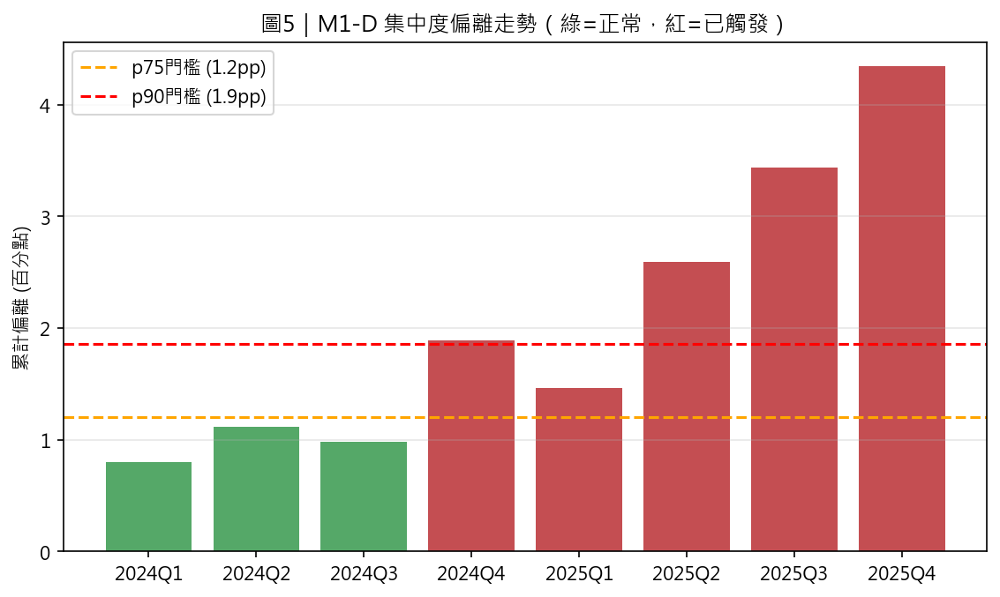

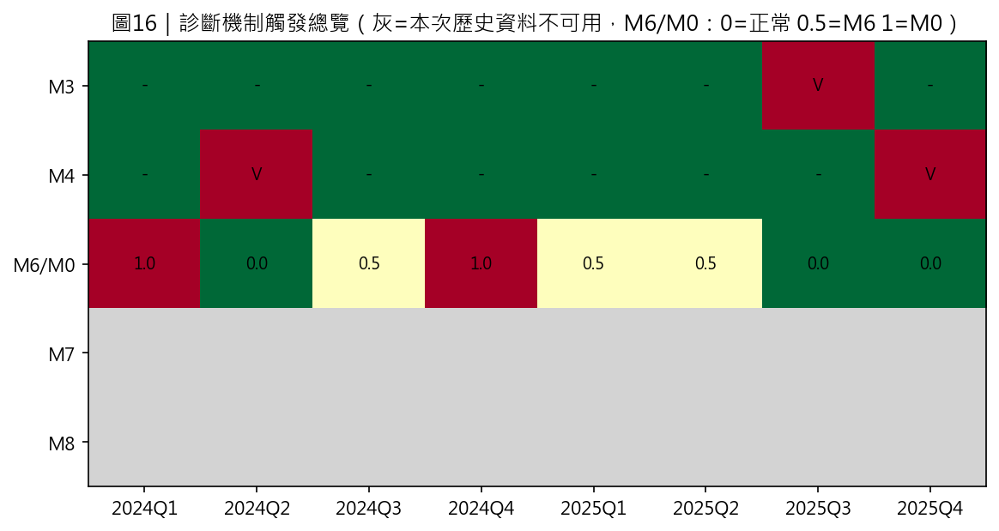

**誠實講一件事**：連續五次亮紅燈，AI 每次都選了最保守的「升級人工覆核」，
**從頭到尾沒有真的選過「條件式市值傾斜」這個新動作**——而且更精確地講，
這8季裡 AI 的決定跟程式依規則算出的建議（正常→維持現狀、警戒→升級人工
覆核）**逐季核對完全一致，沒有一次偏離**（見§1.5的完整揭露）。所以下面的
「調整後」數字，是用一個**假設情境**算出來的——沿用這組真實的燈號跟決定
紀錄，假設「人每次看到升級請求，都核准了市值傾斜這個動作」，而且核准要
等到**下一季**才會真的生效（不能回頭改變已經發生過的那一季，這是誠實的
時間邏輯限制）。

### 3.2 每一季的報酬比較

| 季度 | 基準線（不調整）| 假設核准調整 | 大盤（市值加權）|
|---|---|---|---|
| 2024第1季 | −0.34% | −0.34%（還沒亮紅燈，跟實際一樣）| +13.50% |
| 2024第2季 | +11.64% | +11.64%（跟實際一樣）| +14.11% |
| 2024第3季 | +0.63% | +0.63%（跟實際一樣）| −2.03% |
| 2024第4季 | −4.84% | −4.84%（這季核准，下季才生效，跟實際一樣）| +3.81% |
| 2025第1季 | −2.44% | **−7.68%**（調整生效，這季反而更差）| −9.89% |
| 2025第2季 | −2.00% | **+5.03%**| +8.56% |
| 2025第3季 | +5.40% | **+11.44%**| +17.82% |
| 2025第4季 | −0.13% | **+8.30%**| +12.34% |

**2025第1季是唯一一季「調整後反而更差」**——誠實列出來，不是每一季都穩賺，
但整體加總下來還是明顯的正貢獻（看下面）。

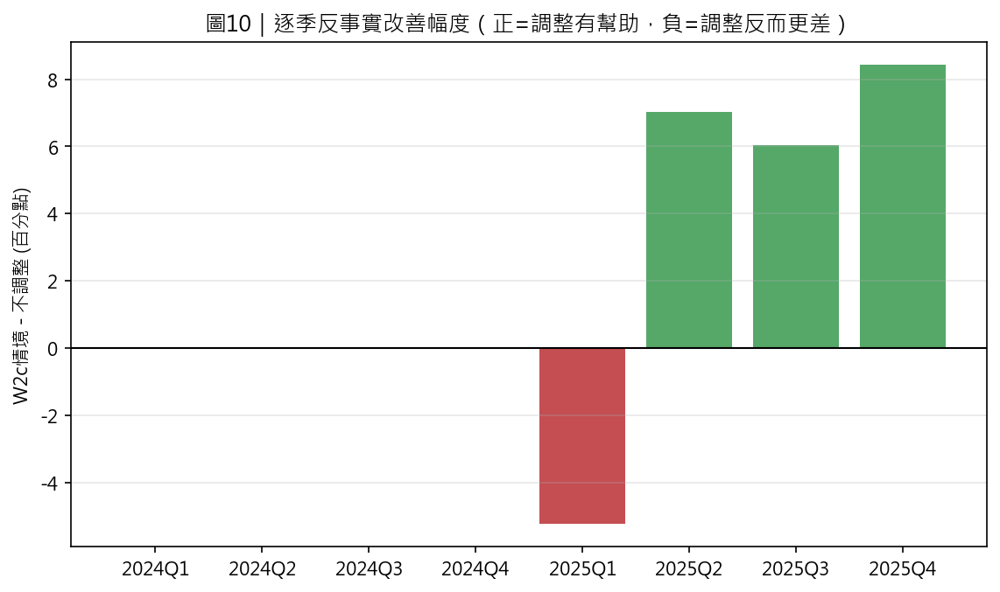

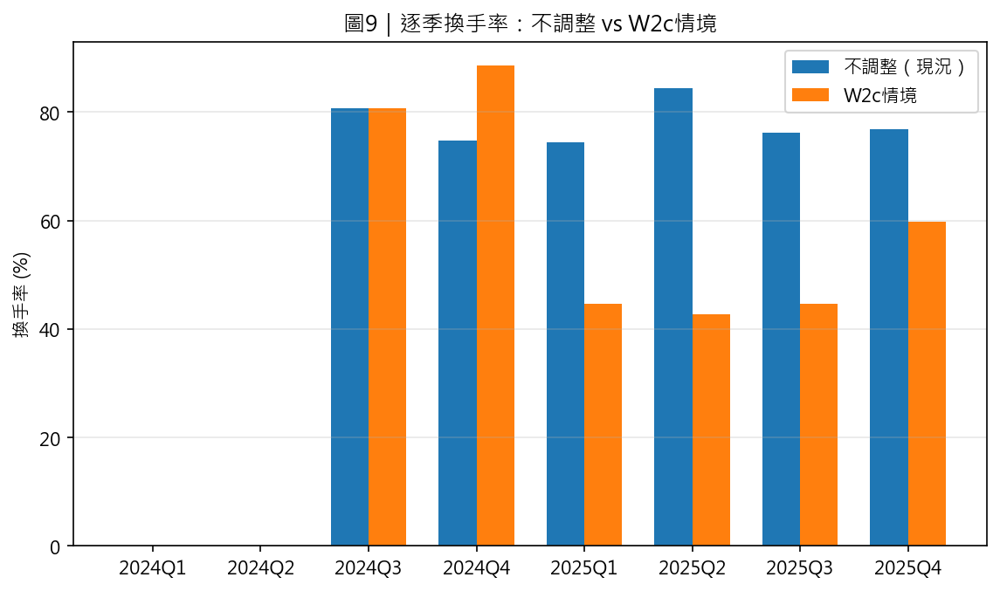

（⚠️ 圖9的換手率用的是「觸發當季即套用」口徑計算，跟本節其餘圖表／表格
「人核准、下季生效」的口徑不同——換手率本身的量級結論不受影響，但逐季
對應的季度標籤不能跟圖10逐格比對。）

### 3.3 整體總結

| | 8季累積報酬 | 換算成年報酬率 | 過程中最慘賠多少（最大回撤）|
|---|---|---|---|
| 基準線（不調整，本身也是回放模擬，並非即時執行的真實部位）| +7.22% | +3.55% | −9.02% |
| **假設核准調整** | **+24.70%** | **+11.67%** | **−12.15%** |
| 大盤（市值加權，含股利）| +70.55% | +30.59% | −9.89% |

（此處採開發追蹤 D54 的原始精確計算值；上方逐季報酬表為四捨五入到小數點
兩位後的顯示值，用顯示值重新複利會得到 +7.23%／+24.68%，跟這裡差 0.02pp，
是顯示精度損失、不是兩套不同算法，報告／簡報一律採本表數字。）

**誠實講這裡的取捨**：調整後報酬大幅提升（多賺了17.47個百分點），**但過程
中最慘的時候賠得也更多**（−12.15% vs 不調整的−9.02%）——因為調整後會把
資金更集中在少數大型股上，2025第1季那次大跌（−7.68%）就是代價。這是「拿
更大的波動風險去換更高的報酬」，不是完全沒有代價的改善。

⚠️ **這裡還要誠實揭露一個更根本的限制：17.47pp 不是一個穩定的估計值**。
首次觸發（2024第4季）的集中度偏離是 1.89pp，門檻是 1.86pp，**只贏了
0.03個百分點**——幾乎是雜訊等級的margin。這代表整條「調整後」情境，從
第一天生效與否開始，就建立在一個極度接近門檻邊緣的判定上。用逐季數字
粗略試算（示意，非重新跑agent）「如果觸發時間點晚一季/晚兩季會怎樣」：
晚一季（改成2025第2季才生效）反而讓改善**放大**到約+24.5pp——因為這樣
剛好躲過2025第1季那次-7.68%的重跌；但晚兩季（2025第3季才生效）又縮回
約+15.7pp，比現在的17.47pp還低——因為這樣連2025第2季的+5.03%也一起
錯過了。**方向不是單調的「越晚越差」，而是要看剛好躲過還是踩到2025第1季
那次回檔**，這代表17.47pp對觸發時點的變化很敏感，本身缺乏穩健性，不是
「重跑會不會拿到相同答案」的隨機誤差問題，而是**單一次、剛好壓線的觸發
事件，換一個時間點結果就可能明顯不同、且方向難以事前預測**。簡報時不宜
把17.47pp講成精確、穩定的效果量，比較誠實的講法是「在這一次剛好如此
發生的觸發時序下，淨改善17.47pp，但對觸發時點高度敏感、方向不固定」。

而且**跟大盤比，不調整落後63.3個百分點、調整後還是落後45.9個百分點**——
差距縮小了，但遠遠沒有追平。這個「為什麼還是追不上」，就是下一節要深入
分析的重點。

⚠️ **誠實揭露：以上本節（3.3節）全部數字都是「毛報酬」，沒有扣交易成本**
（`performance.py`／`_l2_human_approved_w2c.py`這條8季管線本身沒有扣成本
邏輯）。用D50的真實成本模型另外查過：**不調整**這條線扣掉真實換手成本後，
8季累積只剩**+4.31%**（觸發季換手率74%~84%，成本侵蝕約2.9pp）。目前**沒有
針對「人核准、下季生效」這套時序算過淨報酬**，所以+24.70%/45.9pp這兩個
數字也還沒有對應的淨版本——簡報時如果老師問「扣成本後呢」，先誠實回答
「不調整這條線扣完剩4.31%，調整後那條線的淨版本還沒算」，不要用毛數字
硬答。

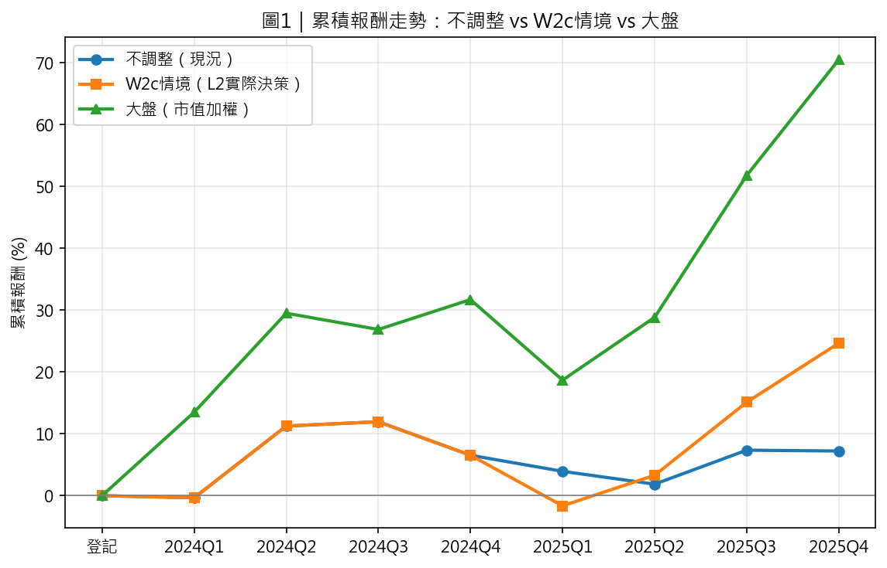

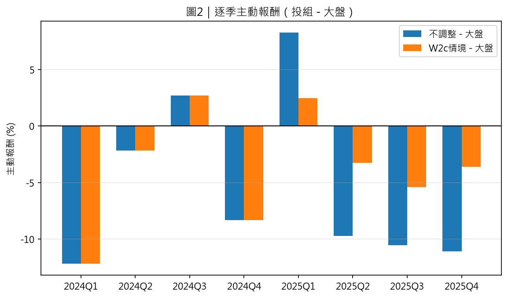

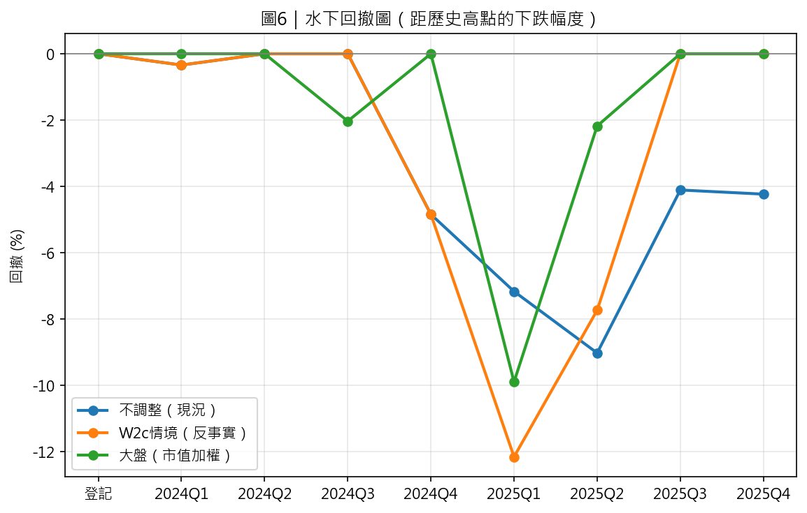

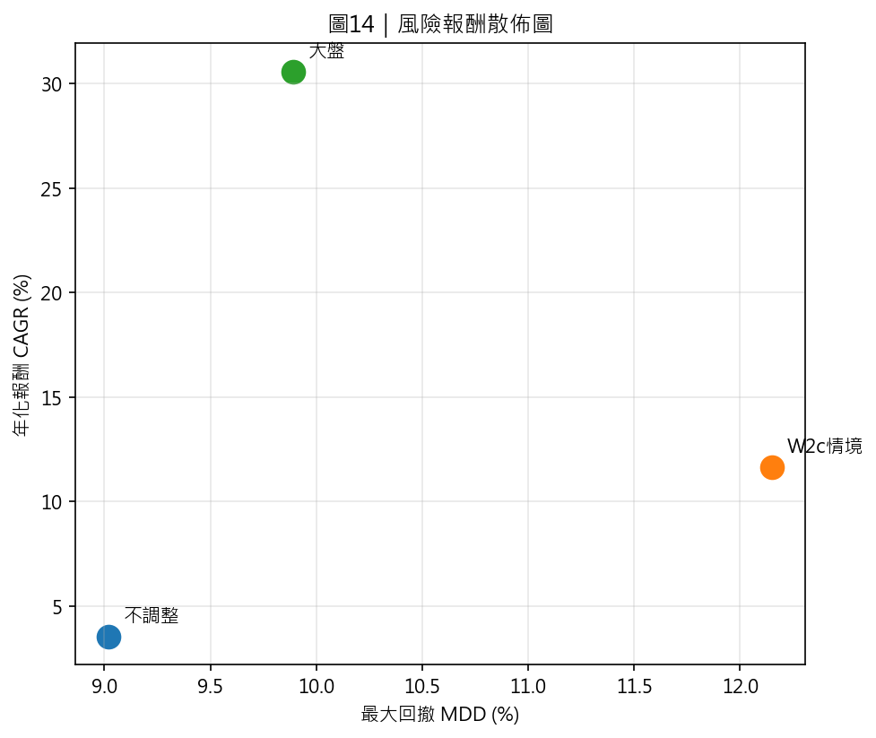

### 3.4 更直接回應老師的驗收標準：只看 2025 單年

老師9/15的驗收標準講的是「**2025**喬到賺錢」，不是8季累積——8季累積
把表現不錯的2024年也算進去，容易模糊焦點。單獨抓2025年（4季）重新算
一次（毛報酬，跟3.3節同口徑）：

| | 2025全年報酬 | 對大盤超額 |
|---|---|---|
| 基準線（不調整）| **+0.63%**（扣真實交易成本後約**−1.19%**，即實際上沒賺錢）| 落後大盤28.84pp |
| **假設核准W2c** | **+17.03%** | 落後大盤12.44pp |
| 大盤（市值加權，含股利）| +29.47% | — |
| 大盤（等權）| +3.14% | — |

**這組數字比8季累積更直接回應老師的問題**：2025年單獨看，基準線（不調整）
毛報酬只有+0.63%，扣掉真實交易成本後其實是**負的（−1.19%）**——嚴格說
2025年不調整並沒有真的賺到錢；要靠**假設核准W2c**才轉正賺到+17.03%，
但即使如此，仍然落後市值加權大盤約12.4個百分點。連等權大盤都只有+3.14%，
也可以看出2025年的大盤漲幅集中在市值加權（也就是被少數超大型股拉抬）的
現象有多明顯。這裡同樣要重申§3.3已經揭露的兩個限制：**17.03%一樣建立
在17.47pp那個對觸發時點敏感、缺乏穩健性的同一個假設情境上**，且這些
絕對數字也一樣受候選池篩選機制影響、不能當預期報酬（見§1.3 M7限制說明）。

---

## 四、深入分析：為什麼還是追不上大盤，這件事能不能修

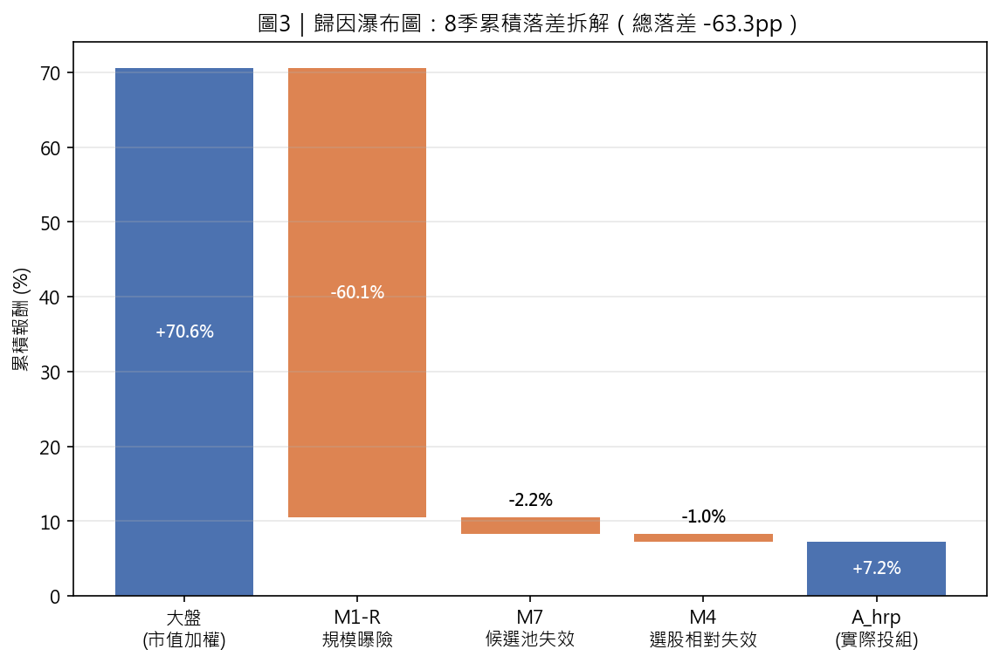

⚠️ **開始拆解之前先誠實講清楚一件事：接下來這一整節的敘事會大量圍繞
「台積電」展開，但落差的大頭其實不是台積電一檔股票造成的**。另外算過
「規模曝險（M1-R）」這塊落差裡，台積電自己貢獻多少、其他大型股貢獻多少
（2024-2025整段期間）：**台積電逐季串接約佔整段落差的四成，其餘約六成
來自其他大型股**（⚠️ 這個比例算的是`研究框架總覽_v10.md`用另一套等權
大盤定義算出來的缺口，數值上跟圖3瀑布圖的−60.1pp不是同一份口徑——圖3的
等權大盤是這條8季管線自己算的+10.46%，v10算的等權大盤是+13.00%，兩者
定義不完全一樣，這裡只借用「四六比例」這個相對結論，不直接套用絕對pp
數字）。也就是說，**造成落差的大型股裡，台積電只是其中一部分，多數其實
是別的股票**。下面幾節會深入查證「為什麼選不到台積電」，這條調查線本身
是成立的、也查得很仔細，但要提醒：**它大概只解釋了大型股問題裡的四成，
不能誤讀成「解決台積電問題＝解決全部落差」**。

另外要注意：W2c機制（下面會提到的+17.47pp改善）只在「已經被選中的股票」
裡面重新配重。實際去查真實的W2c情境持股，8季裡有7季的權重增加最多的
股票依序是**鴻海(2317)、廣達(2382)、台達電(2308)，以及富邦金(2881)／
國泰金(2882)／中信金(2891)這幾檔金融股**，完全沒有台積電（因為根本沒
被選中）；**唯一的例外是2025第4季**（用的是2025年9月底那次台積電估值
濾網剛好放行的選股結果），台積電也被加碼到7%上限，那一季的改善才可能
有部分來自台積電。所以精確地講：**7/8季的改善確定跟台積電無關，只有
最後一季可能有台積電的貢獻在裡面**。

### 4.1 先排除一個直覺的解法：把持股上限調高一點

系統原本自己訂了一條規則：「單一一檔股票最多只能佔投組8%」（比任何真實
法規都嚴格——台灣舊規定是單一持股10%）。2026年4月生效的新規定（俗稱
「台積電條款」）把上限放寬到25%，但**這條新規定是有條件的，不是全面放寬**：
只有「佔加權指數權重超過10%」的個股才適用，而且投資比例不能超過該股自己
的大盤權重，上限封頂25%——**新規定生效當時，全市場只有台積電一檔符合
這個門檻**。這件事很關鍵：**這個投組8季裡有7季完全沒有持有台積電**（見
下一節），也就是說這7季裡，就算真的有股票逼近持股上限，那檔股票也不是
台積電，適用的其實還是舊制的10%，新制25%用不到。重新驗證一次，這次把
真正適用的10%（舊制）也列進來，不只列理論上限但用不到的25%：

| 持股上限 | 跟大盤的差距（8季，扣掉交易成本）|
|---|---|
| 7%（現行實際使用的目標值，比自訂的8%再留一點緩衝）| 落後大盤 42.5% |
| **10%（舊制，這個投組7/8季實際能引用的法規依據）**| **落後大盤 41.2%** |
| 25%（新制「台積電條款」，僅適用台積電，這個投組多數季度用不到）| 落後大盤 38.4% |

⚠️ **口徑提醒（兩層差異，都要交代）**：這裡的三個數字跟3.3節的45.9pp
**不能直接比大小**。①**時序不同**：3.3節是「M1-D觸發、人核准後、下一季才
生效」（跟agent實際決策記錄一致）；這裡是「觸發當季就直接套用」（純粹測試
持股上限本身的效果，不含核准時間差）。②**毛淨不同**：3.3節的45.9pp是毛
報酬（未扣交易成本）；**這裡的數字已扣真實交易成本**（本節唯一扣過成本的
數字）。簡報時建議固定用3.3節的45.9pp（毛）當主要數字，這裡的結論限定
講成「在扣成本、當季套用的前提下，調高上限幫助有限」。

**真正該拿來跟現行7%比較的，是這個投組實際用得到的10%（舊制），不是
理論上限25%（新制，多數季度用不到）**：7%→10%只多縮小約1.3個百分點，
比7%→25%的4個百分點看起來更弱。這個結果本身就是個更強的線索：**問題不在
持股上限訂得太嚴，把上限拉到理論最大值，對這個具體投組的幫助也很有限**。

⚠️ **這裡的10%是無緩衝版本，還沒測合乎法規、留緩衝的實際可用版本**：
表上的10%目標值，季中價格漂移後有3次實際超過10%的法規硬上限（7%那行
只有1次、25%那行也只有1次）；真的要拿舊制10%當政策，比照現行7%相對
自訂8%留1個百分點緩衝的邏輯，實際會用大約9%當目標值（留緩衝），這個
版本還沒測過。不過這個方向只會讓「調高上限幫助有限」這個結論更成立
（留緩衝的9%改善幅度只會比無緩衝的10%更小），不影響上面的結論，這裡
註記清楚即可，不需要因此重新驗證。

### 4.2 真正的原因：那檔股票在「選股」這一步就已經被刷掉了，跟怎麼分配資金無關

系統的流程是**先選股（用一套「體質好不好、便不便宜」的邏輯篩出候選名單），
後分配資金**。仔細查證這次實際用的 30 個選股方法，逐一檢查真實 8 個季度：

> **8 季裡有 7 季，這 30 個方法完全沒有一個選中台積電；唯一的例外是
> 2025年第3季，30個裡有3個選中**——而且這個例外有清楚的原因：那一季台積電
> 的本益比相對自己過去的平均水準剛好降溫，讓原本被擋住的一道估值濾網首次
> 放行。不是資料出問題，是選股邏輯正常運作下自然發生的結果。

這 30 個方法主要看的東西：

| 主要邏輯 | 白話意思 | 方法數 |
|---|---|---|
| 估值便宜 | 找股價相對便宜的股票 | **16個（佔一半以上）**|
| 動能強 | 找最近漲勢強的股票 | 4個 |
| 現金流品質好 | 找賺的錢真的變成現金、不是紙上富貴的股票 | 3個 |
| （其餘組合）| | 30個合計 |

台積電動能夠強、現金流品質也不差（這兩類方法其實會選中它），**但它的股價
一直不便宜**——在「找便宜股票」這類方法眼中，它的排名必然落在貴的那一邊，
**不是資料缺失或程式漏洞，是這套「找便宜股票」的邏輯設計上必然會發生的結果**。

**結論：分配資金的機制，只能在『已經選中的股票』裡面重新分配，台積電從
選股那一步就沒有進到候選名單裡，後面不管怎麼調整分配方式都碰不到它。**
這是選股方法論本身的結構性盲區，跟後面的執行或資金分配完全無關。

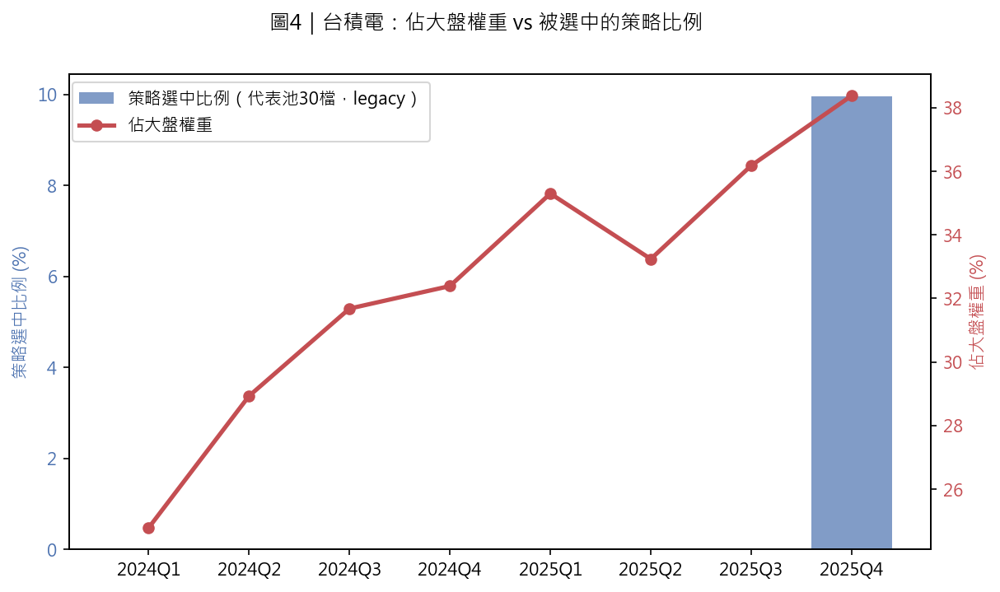

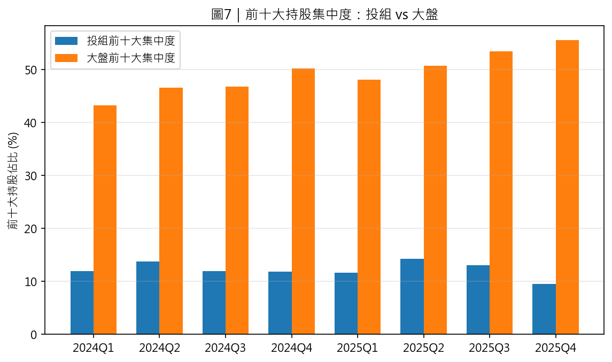

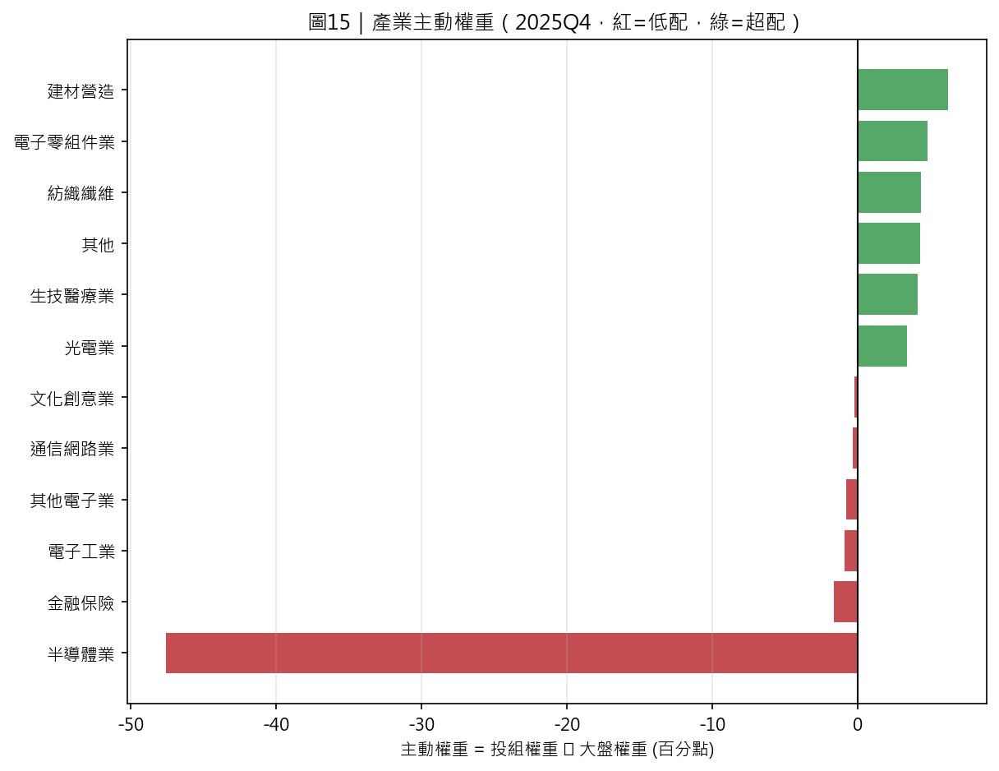

### 4.3 換五個不同角度反覆驗證，結果都吻合

**角度一：把候選名單放大會不會就選到了？** 把 30 個方法放大到 668 個方法，
**還是解決不了問題**——8季裡7季一樣完全掛零，只有1季選中個位數。

**角度二：是「篩選過的候選名單」問題，還是「所有方法（沒篩選過）」都有這個
問題？** 直接檢查全部 7,128 個候選方法（完全不經過篩選）：

| | 選中台積電的比例 | 有沒有整季完全掛零過 |
|---|---|---|
| 全部 7,128 個方法（不篩選）| 1.67%～9.95%（每季都有一些會選到）| **從未整季掛零** |
| 篩選過的代表名單（30～668個）| — | **8季裡7季完全掛零** |

兩層問題疊加：候選名單本身選中台積電的方法本來就是少數（這是選股邏輯本身
的特性，就算不篩選也存在）；篩選這個步驟，又把這個已經偏低的比例進一步
放大到幾乎完全排除。

**角度三：是「股票太大」的問題，還是「股票太貴」的問題？** 換兩檔同樣是
權值股的股票測——鴻海（傳產代工，股價相對便宜）跟聯發科（半導體，股價偏貴）：

| 股票 | 8季曾選中比例 | 佔大盤權重 |
|---|---|---|
| 台積電 | 12.91% | 24.78%→38.38%（最大）|
| **鴻海（便宜的大型股）**| **36.95%（反而是三者裡最高的）**| 2.33%→3.42%（小很多）|
| 聯發科 | 9.68%（最低）| 2.39%→3.14%|

⚠️ **這裡的「貴」是標籤，不是量測**：鴻海／聯發科在文字上寫「便宜／貴」，
只是憑印象貼的標籤，沒有實際拿系統既有的估值濾網（V濾網）通過率逐檔算過
——嚴謹一點應該用「這幾檔股票各自通過多少個估值濾網」這種可量化的方式
呈現，而不是直接下形容詞。另外要更正：**聯發科的大盤權重在這張表看起來
只有2.39%→3.14%（比鴻海還低），但那只是相對台積電（最大24.78%→38.38%）
顯得小，聯發科實際上是台股市值排名很前面的大型股，不是「中型股」**——
表格權重比例小主要是因為台積電自己就佔了大盤三到四成，把其他所有股票的
相對佔比都比下去，不代表聯發科的公司規模不大。

鴻海的規模小很多，卻更常被選中——**問題核心比較像是「股價貴不貴」，不是
單純「公司大不大」**，但這裡的「貴」目前仍是質化描述、尚未有逐檔的量化
估值指標佐證，台積電剛好又(質化認定的)貴又是規模最大的，兩個特性疊加，
讓它的情況最極端。

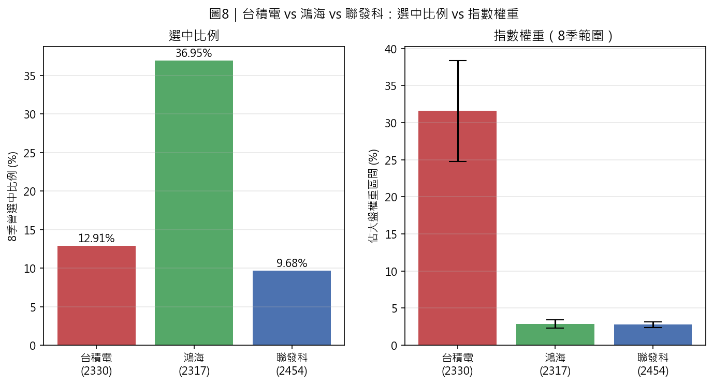

**角度四：是這兩年特有的，還是本來就一直存在的問題？** 換更早的三段歷史
（2015-2017、2018-2020、2021-2023）測：四段歷史「曾經選過台積電」的比例
驚人地穩定（都在10.87%～12.91%之間），**這個結構性問題十年來一直都在**；
但過去三段歷史**每一季都還是會有零星選中、從沒有整季完全掛零過**，只有
這次2024-2025出現連續7季完全掛零，而同一段時間台積電佔大盤的權重也剛好
創下歷史新高——**這代表這是一直都存在的老問題，只是這次剛好碰上股價貴到
歷史級的極端程度，才被放大成從沒出現過的嚴重情況，不是方法論突然壞掉**。

**角度五：美股會不會也有這個問題？** 換 NVIDIA（同期美股AI題材的代表股）測：
NVDA 8季曾選中比例是6.33%（比台積電還低），**但從沒有整季完全掛零過**——
跟老師提到「美股不會發生這個問題」的觀察吻合。⚠️ **這裡要誠實講清楚
證據力道**：這只是**單一一組股票對照**（NVDA vs 台積電），只能講「這個
結果與『差異來自台股大盤集中度遠比美股更極端』（台積電佔大盤權重衝到
38%，NVDA佔美股大盤權重沒有這麼極端）這個假說一致」，還不足以說「已經
證明」是這個原因，也不能排除還有其他美股/台股選股方法本身的差異在起
作用，只是這裡沒有測到。要更有把握，需要多測幾組美股權值股（不只NVDA
一檔）才能講得更肯定。

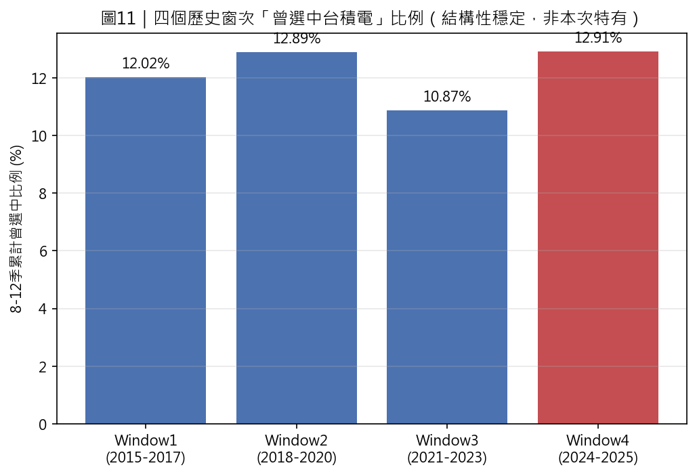

### 4.4 找到最後一塊拼圖：篩選規則本身對「大群」不公平

把這次篩選代表方法時實際用的分群結果攤開來看，查台積電相關方法分布在
哪些群：

| 群 | 這個群裡有多少方法 | 這個群裡有多少比例是台積電相關方法 | 佔全部台積電相關方法的比重 | 5個代表名額裡選中幾個台積電相關方法 |
|---|---|---|---|---|
| **群3** | **2,336個（最大的一群）**| 22.6% | **59.7%（快六成集中在這一群）**| **0個** |
| 群6 | 1,497個 | 15.1% | 25.6% | 1個 |
| 群5 | 273個（小群）| 26.7%（比例最高）| 8.3% | **2個** |
| 群2 | 2,258個（次大的一群）| 2.5% | 6.5% | 0個 |
| 群1／群4 | 240／75個 | 0% | 0% | 0個 |

（此表6群方法數加總＝240+2,258+2,336+75+273+1,497＝6,679，跟window4真實
候選池策略數一致；這裡選中的 0+0+0+0+2+1=3 個，跟前面查到的「30個代表裡
有3個曾選中台積電」完全對得上）

**真正的機制找到了**：不是篩選代表時對台積電相關方法有偏見（已經測過並排除
這個可能）——是現行規則「**不管一個群裡有多少方法，固定都只挑5個代表**」，
讓裝了快六成台積電相關方法的那個最大群（2,336個方法），實際只能挑出5個
代表，代表比例只有0.21%，遠低於小群的1.83%（差了快9倍）。

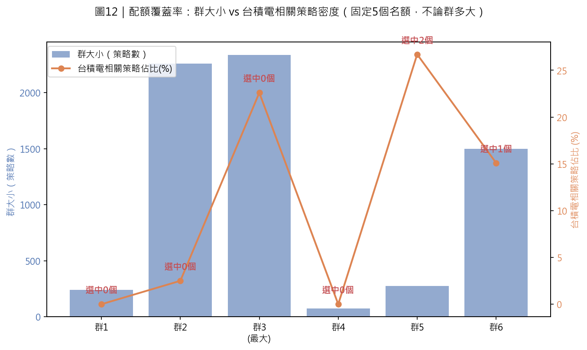

### 4.5 試著修這個規則能解決嗎？兩輪測試，答案是「規則本身修得動，但還是救不了台積電」

**第一輪：系統裡本來就有的「依群大小比例分配名額」規則**——這正是最直覺
的修法，而且系統早就有這個現成選項、早就算好放在那裡了，不用另外寫程式。
實測結果：改用這個規則反而只選中2個台積電相關方法，比現行規則的3個還
**更差**——因為雖然把最大那群的名額從5個拉高到10個，但同時把「比例最高的
小群」名額從5個砍到只剩1個，一好一壞互相抵銷。**這個直覺解法系統早就有、
也真的測過了，結果是不夠用。**

**第二輪：設計一個全新規則「保底名額」**——每個群額外多給1個名額，專門
保留給「品質最好、而且會選中前十大權值股裡任何一檔」的方法（這是業界指數
增強型基金常見的正當做法，目的是確保前十大權值股整體都有一定覆蓋率，不是
特別為了硬塞台積電設計的）。實測結果：

| | 前十大權值股整體覆蓋率 | 台積電 | 聯發科 |
|---|---|---|---|
| 現行規則（30個代表）| 6/30（20%）| 沒選中 | 沒選中 |
| **+保底名額（36個代表）**| **12/36（33%，翻倍）**| **還是沒選中** | **還是沒選中** |

保底名額這個機制本身確實有用（整體覆蓋率翻倍了，多選中了廣達、金控股這類
相對便宜的權值股），**但六個群裡沒有一個群的保底名額選到台積電或聯發科**——
即使前十大權值股裡本來就有幾檔比較容易被選中，**台積電、聯發科依然是這十檔
裡股價最貴的兩個異類，連這種通用的保底機制都碰不到它們**。

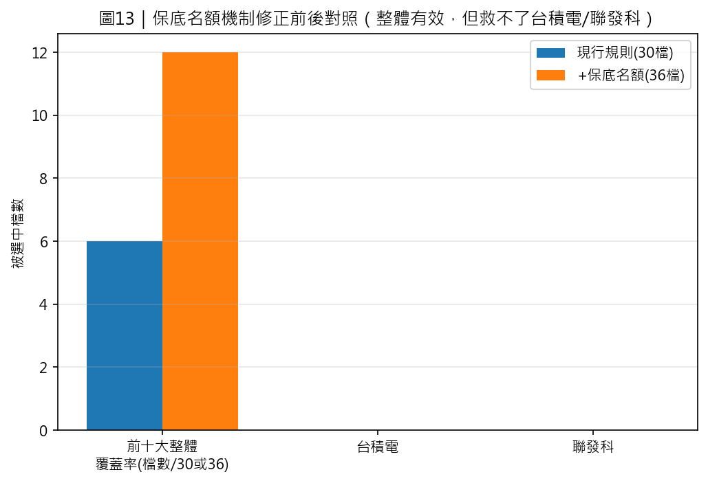

**結論：修規則這條路已經測到底了**——不是規則設計得不夠好，是問題核心真的
在於股價貴到太極端這件事本身。

### 4.6 用基金公司的角度看：這是業界已知的現象，不是系統設計有缺陷

「價值型策略會系統性地錯過股價昂貴的市場龍頭股」，這是量化投資業界公認
存在的現象（不少老牌價值型基金過去也曾長期低配、甚至完全不碰股價持續偏高
的龍頭成長股）。業界標準做法不是回頭放寬篩選條件、硬把龍頭股塞進來（那叫
「風格漂移」，是基金治理的大忌），而是：

- **守住風格紀律，誠實揭露取捨**：明確告知投資人「這是我們這種風格必然的
  取捨，不是操作失誤」——這正是這套系統目前在做的事（燈號偵測＋誠實記錄）。
- **另外切一塊「核心」部位**：在價值型策略之外，額外配一塊市值加權或品質
  因子的部位，兩塊分開管理——這個做法**不在目前這套系統的設計範圍內**，
  要不要往這個方向做，需要老師決定（見第六節）。

**一句話總結**：這不是調整資金分配方式能解決的，也不是簡單改個篩選規則能
解決的——是選股方法論本身（找便宜股票的邏輯）跟這段時間的市場走勢（被單一
龍頭股主導、股價評價大幅重估的行情）根本性地不匹配。

---

## 五、呼應老師 9/15 其他要求的進度

| 老師的要求 | 現況 |
|---|---|
| 監控畫面越少越好 | ✅ 兩個畫面：①監控與診斷報告 ②決策與總結 |
| 當月／當季／半年／一年都要有解釋 | ✅ 已完成（底層每季量測一次，另外做了一層把多個季度串起來看的敘事整理）|
| 能跟 AI 對話討論 | ✅ 介面已做好（可以對任一真實季度的決定草案，開最多5輪對話），**但還沒有真的拿它跑過一次真實對話** |
| 慢時鐘（兩年才重跑一次的長週期機制）| 依老師指示暫緩（老師說「可能還不太需要」），目前只做每季一次的快週期監控 |

---

## 六、需要老師拍板的決策

| # | 事項 | 現況 |
|---|---|---|
| 1 | **針對「把2025喬到賺錢」這個標準，直接看2025單年（見§3.4）：不調整2025年其實沒賺錢（毛+0.63%、扣成本−1.19%），假設核准W2c才轉正賺到+17.03%，但仍落後大盤約12.4個百分點——這樣「有賺到錢、但落後大盤、且有清楚原因解釋」算不算滿足要求？** 還是要繼續往「追平大盤」的方向努力？（8季累積口徑下同樣的問題是落後45.9pp，但2025單年更貼近老師原話的驗收範圍）| 待老師定調 |
| 2 | **要不要調整持股上限的政策**（現行自訂8%）？改成**舊制10%**（這個投組多數季度實際適用的法規依據）效果有限，只多縮小約1.3個百分點；改成**新制25%「台積電條款」**雖然多縮小約4個百分點，但這條新規定僅適用「佔大盤權重逾10%」的個股（目前全市場只有台積電符合），而這個投組8季有7季根本沒持有台積電，多數季度用不到25%這條| 待拍板 |
| 3 | **要不要額外增加一塊「市值加權／品質因子」的部位？** 這樣才能真正觸及台積電這類股票，但這是更大範圍的架構決定，超出這套系統目前的設計範圍 | 待拍板 |
| 4 | 選股邏輯本身要不要調整，除了「找便宜股票」之外，也納入一些「找體質好、成長性佳」的邏輯，讓候選名單本身就能選到台積電這類股票？| 待拍板，範圍較大 |
| 5 | ~~篩選代表方法的名額分配規則要不要調整？~~ | ✅ **已經測到底、確定這條路走不通**——系統現成的規則、跟新設計的規則都測過，確認問題不是這條規則能修的，是股價貴到太極端本身。**不需要麻煩老師拍板**，直接排除，把心力放在第3、4項 |
