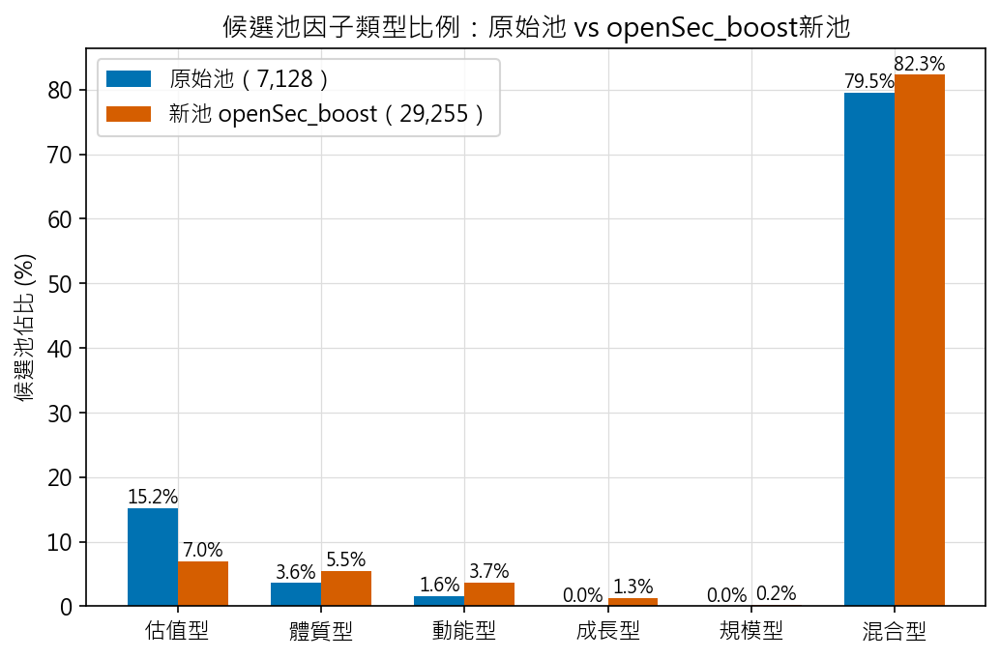
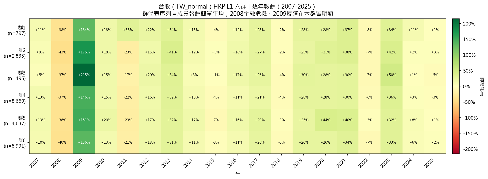
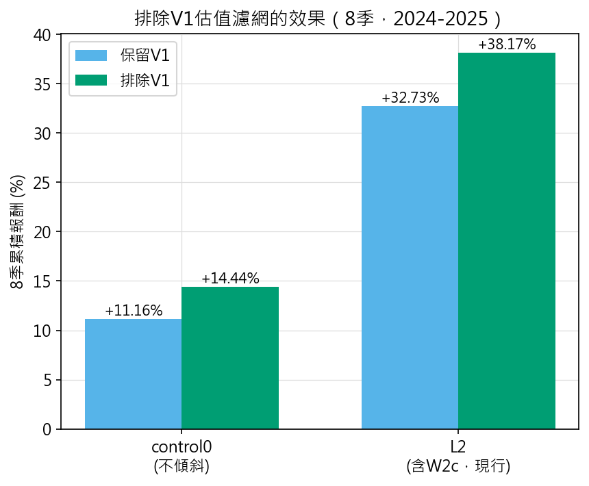
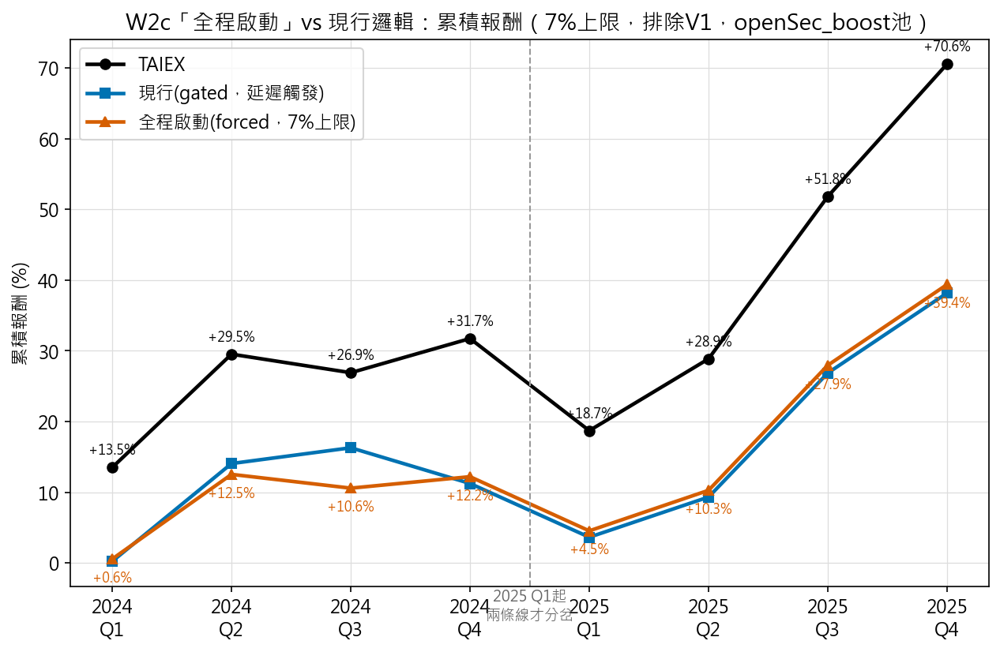
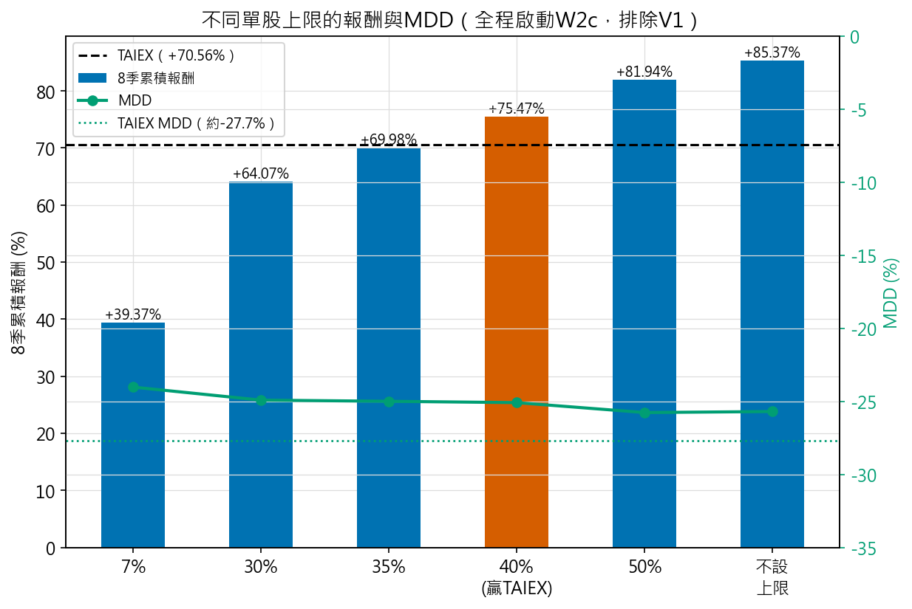
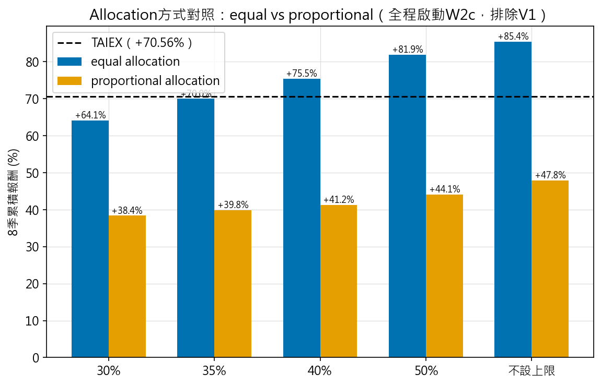
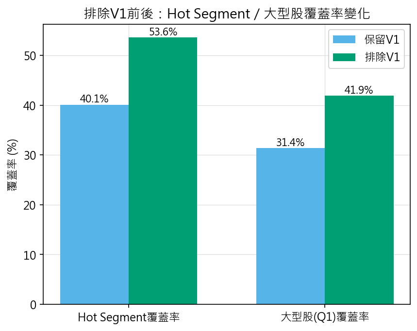

# 研究進度報告 · 2026-10-05

> 上次會議：2026-09-29。這份報告聚焦這週做的最大一項調整：**重新檢視主力因子組成，
> 發現過關的9個主力因子裡估值型佔了4個，難怪選股結果一直偏向估值股、難以跟上
> AI/半導體驅動的2024-2025大盤行情**。這次做了三件事：①調整F/C因子組成，
> 把原本只能當secondary、但在2024-2025個別表現顯著贏大盤的5個因子強制提升為
> primary；②延續排除V1估值濾網的既有結論，在新因子池上重新驗證；③把W2c這個
> 市值傾斜機制的觸發時機、單股上限兩個參數做完整的敏感度測試。
>
> 下次會議：2026-10-07。

---

## 一、這次調整了什麼

### 1.1 因子組成調整（F/C因子）

**新池F1因子（主力因子）共14個**：

| F1因子 | 類型 | 作為F1的策略數 |
|---|---|---|
| EV_S | 估值型 | 2,890 |
| PB | 估值型 | 3,157 |
| PS | 估值型 | 2,970 |
| P_IC | 估值型 | 3,221 |
| OCF_E | 體質型 | 1,623 |
| ROE | 體質型 | 1,747 |
| EPS | 體質型 | 71 |
| ROIC | 體質型 | 971 |
| MOM | 動能型 | 3,351 |
| MOM_3M | 動能型 | 547 |
| PROX_52WK_HIGH | 動能型 | 1,920 |
| EPS_G | 成長型 | 2,501 |
| ROE_G | 成長型 | 4,222 |
| REV_G | 規模型 | 64 |

組成脈絡：原始的6個（EV_S／PB／PS／P_IC／OCF_E／MOM，Phase1單調性檢定過關的
主力因子）+ EPS_G／ROE_G（成長型，單獨也通過Phase1）+ 這次強制提升的5個
（**ROE／EPS／ROIC／REV_G／MOM_3M**，Phase1過關但原本單獨強度margin不足，
這次針對2024-2025表現顯著贏大盤，強制提升為primary）+ PROX_52WK_HIGH
（新因子，Phase1過關直接列入）。

**C因子（動態條件）**：由6個來源因子 × 7種動態規則組成，共**42個C條件**
（另加「無C條件」選項）：

| 來源因子 | 類型 | 套用的7種動態規則 |
|---|---|---|
| EV_EBITDA | 估值型 | 較上季升／較前兩季升／近4季最高／近8季最高／年增為正／今年均>去年同期均／今年均>去年全年均 |
| PROX_52WK_HIGH | 動能型（新增來源）| 同上7種 |
| EPS_G | 成長型（新增來源）| 同上7種 |
| DEBTRATIO | 結構型 | 同上7種 |
| REV_G | 規模型 | 同上7種 |
| OCF_E | 體質型 | 同上7種 |

原始池的C因子只綁定ROE／EPS／FCF_P三個來源因子（3×7−1=20個C條件）；
這次改成上述6個來源因子，新增動能型（PROX_52WK_HIGH）與成長型（EPS_G）兩個全新類別。

**整體規模效應**：
- TW候選策略池：**7,128 → 29,255**
- HRP分群數：**6**（用輪廓係數重新計算，不是沿用舊值）
- 研究部主鏈（stage0~4、k_stability、walkforward_matrix）針對TW完整重跑過

### 1.2 候選池因子類型比例：估值型佔比砍半以上

| 因子類型 | 原始池（7,128） | 新池（29,255） |
|---|---|---|
| 估值型 | 15.2% | **7.0%**（↓砍半以上）|
| 體質型 | 3.6% | **5.5%**（↑）|
| 動能型 | 1.6% | **3.7%**（↑）|
| 成長型 | 0%（原本不存在）| 1.3%（新出現）|
| 規模型 | 0%（原本不存在）| 0.2%（新出現）|
| 混合型（F1×F2跨類型組合）| 79.5% | 82.3% |

估值型佔比確實大幅下降、體質型與動能型確實上升，方向符合這次調整的目的。

### 1.3 每年賺賠：HRP六群2007-2025年度報酬

展示新因子池下六個分群各自在2007-2025每一年的賺賠分布。

### 1.4 HRP六群的定性與定量描述

新因子池重建分群後，六群各自的身份標籤（LLM依成分特徵描述）與定量績效側寫：

| 群 | 成員數 | 身份描述 | CAGR中位數 | 正報酬年比例 |
|---|---|---|---|---|
| 1 | 797 | 台股混合因子群（ROE/EPS成長與近52週高）| 16.3% | 79% |
| 2 | 2,835 | 以動能為主的台股混合型策略群 | 15.0% | 79% |
| 3 | 495 | 台股混合/估值因子策略群 | 14.7% | 74% |
| 4 | 8,669 | 台股混合型因子為主策略群 | 12.7% | 68% |
| 5 | 4,637 | 台股混合因子、估值主導群 | 15.9% | 74% |
| 6 | 8,991 | 台股混合型，偏ROE與成長 | 12.7% | 74% |

身份標籤明顯反映新因子組成的特色（群1/群6出現「ROE/EPS成長」、群2以動能為主），
不再是舊池那種清一色「估值為主」的描述。

群與群之間的關係：15組兩兩配對的相關係數落在0.702~0.990，大部分落在「低互補」
區間（相關係數>0.8），只有6組落在「中互補」（0.5~0.8），**沒有任何一組達到
「高互補」**——這跟既有結論一致（分散效果主要來自市場邊界、不是因子邊界）：
全部6群都是純台股群，同市場內的群彼此關聯性本來就偏高，這次新因子池並未改變
這個基本結構。

---

## 二、實戰驗證第一步：排除V1估值濾網

前10%/後10%最佳最差策略分析：**V1（PE估值濾網）在最差10%策略裡占94.1%、
最佳10%只占17.1%**——是2024-2025這個regime下真正的分水嶺，不是F1因子類型
本身。真實8季LLM生產模擬驗證（2024-2025）：

| | control0（不傾斜） | L2（含W2c，現行邏輯） |
|---|---|---|
| 保留V1 | +11.16% | +32.73% |
| **排除V1** | **+14.44%** | **+38.17%** |

兩組對照都改善，確認排除V1是這整個改善鏈最基礎、也最紮實的一步。

---

## 三、核心修正：W2c「提早啟動」

### 3.1 問題：現行邏輯觸發後會晚1~2季才真正生效

W2c（市值傾斜機制）現行production邏輯是：M1-D偵測到市值集中度異常觸發後，要等
「上一季的決策也是W2c」才會真正啟動傾斜，等於偵測到異常後還要再等1~2季才生效。
測試拿掉這個等待、**改成一偵測到規律就從第一季開始啟動**：

| 季度 | TAIEX累積 | 現行(gated)累積 | 全程啟動累積 |
|---|---|---|---|
| 2024 Q1 | +13.50% | +0.22% | +0.55% |
| 2024 Q2 | +29.52% | +14.05% | +12.52% |
| 2024 Q3 | +26.90% | +16.28% | +10.57% |
| 2024 Q4 | +31.73% | +11.23% | +12.19% |
| 2025 Q1 | +18.70% | +3.63% | +4.53% |
| 2025 Q2 | +28.86% | +9.31% | +10.26% |
| 2025 Q3 | +51.82% | +26.85% | +27.95% |
| 2025 Q4 | **+70.56%** | **+38.17%** | **+39.37%** |

在現行7%上限下，提早啟動本身的效益有限（+39.37% vs +38.17%，+1.2pp）——
**真正的效益要跟放寬單股上限疊加才會放大**，見下一節。

### 3.2 疊加放寬單股上限：40%時打贏大盤，且風險不增反減

同一套「全程啟動」邏輯，放寬W2c的單股上限（現行政策是7%）：

| 上限 | 8季累積報酬 | 超額(vs TAIEX+70.56%) | MDD |
|---|---|---|---|
| 7%（現行） | +39.37% | −31.19pp | −24.03% |
| 30% | +64.07% | −6.49pp | −24.92% |
| 35% | +69.98% | −0.58pp | −25.00% |
| **40%** | **+75.47%** | **+4.92pp（贏過TAIEX）** | **−25.09%** |
| 50% | +81.94% | +11.38pp | −25.77% |
| 不設上限 | +85.37% | +14.81pp | −25.70% |
| TAIEX（同期） | +70.56% | — | 約−27.72% |

**40%上限打贏大盤的這個版本，最大回撤（−25.09%）反而比TAIEX本身（約−27.72%）
還小**——不是單純拿風險換報酬，報酬跟風險同時改善。而且MDD隨上限放寬幾乎不變
（從7%的−24.03%到不設上限的−25.70%，僅約1.7pp差距），全程都比TAIEX的MDD更小。

🔴 **誠實代價**：要做到40%以上上限，代表單一個股（幾乎確定是台積電）在投組裡
佔到接近40%權重，本質上接近「單押台積電」而非「策略分散＋貼近大盤」，這是需要
明確表態的風險屬性取捨，不是單純技術參數選擇。

### 3.3 Allocation方式測試：equal優於proportional

同一套「全程啟動」情境，把目前使用的equal allocation（代表名額每群平均分配）
換成proportional allocation（代表名額依HRP群大小按比例分配）：

proportional在任何上限下都沒贏過TAIEX（+38.38%~+47.84%，皆低於TAIEX+70.56%），
MDD也全面更差（約−30~31% vs equal的約−25%）。結論：維持equal allocation。

---

## 四、Hot Segment／大型股覆蓋率

排除V1對兩項覆蓋率指標都有大幅提升：

- Hot Segment覆蓋率：40.1% → **53.6%**
- 大型股(Q1)覆蓋率：31.4% → **41.9%**

另外釐清一個機制上的細節：W2c啟動後（不論現行或全程啟動），**大型股權重覆蓋
穩定在89-94%，但Hot Segment(動能)權重覆蓋變動很大（7.5%-50.3%）**——這說明
W2c真正的機制是「貼近大型股權重」，不是「追熱門動能股」，兩者只是在2025下半年
剛好同時發生，不是同一件事。

---

## 五、已測試但排除的方向

為了完整交代，以下方向都已測試過、結論是負面或無效，不建議採用：

- **放寬代表策略挑選數量（ratio）**：候選池成分比例幾乎不變，OOS表現反而變差
- **近期加權品質指標**（用近60/36/24個月報酬取代全樣本Calmar挑代表策略）：
  因子類型成分確實轉向動能型，但OOS表現單調隨窗口縮短變差，窗口越短越差
- （以上皆為舊結論，這次用新因子池重新驗證過仍然成立）

---

## 六、資料品質查核

用`research.diagnose_price_anomalies`深度掃描驗證：TW已知的全部價格異常事件
最晚到2024-05-02，完全沒有觸及2025-2026，本次報告所有涉及2024-2025的數字
都是乾淨的，不受已知資料異常影響。

---

## 七、待老師拍板的決策點

1. **要不要正式採用「W2c全程啟動」機制**，取代現行的延遲觸發邏輯？
   🔴 **誠實限制**：W2c這個機制本身（市值傾斜）已有完整的前置驗證歷史，但「要不要
   跳過延遲觸發、改成一偵測到規律就啟動」這個具體時機點判斷，是直接在這同一組
   2024-2025共8季資料上測出來的，**還沒有在其他時間窗驗證過泛化能力**，正式採用
   前建議先在另一段歷史期間（例如2019-2023）做樣本外驗證。
2. **要不要放寬單股集中度上限**（現行7%→30%/40%），以及能接受到什麼程度的
   「單押台積電」集中度風險？
3. 第四章定位、論文骨架相關的既有待拍板事項（沿用先前清單）
